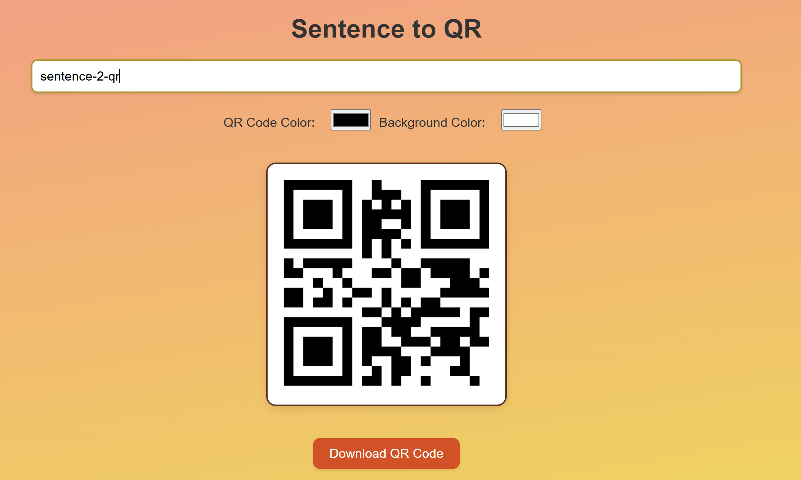

# Sentence-2-QR

🚀 **Sentence-2-QR** is a minimal and intuitive React app that generates QR codes for any given sentence or word. It offers customizable QR colors, dynamic background effects, and a seamless download feature.

## 🎯 Features
- **Instant QR Generation:** Enter any text, and the app instantly creates a QR code.
- **Customizable QR Colors:** Choose the foreground and background colors of the QR code.
- **Download Functionality:** Save the generated QR code as an image.
- **Minimal & Aesthetic UI:** Gradient backgrounds and smooth hover effects.
- **Dynamic Background:** A live wallpaper effect that changes with cursor movement.

## 📂 Project Structure
```
sentence-2-qr/
├── public/
│   ├── index.html
│   ├── favicon.ico
├── src/
│   ├── components/
│   │   ├── QRGenerator.js
│   ├── App.js
│   ├── index.js
│   ├── App.css
│   ├── index.css
├── package.json
├── README.md
```

## 🚀 Installation & Setup
1. Clone the repository:
   ```sh
   git clone https://github.com/sanidhyaprakash/sentence-2-qr
   cd sentence-2-qr
   ```
2. Install dependencies:
   ```sh
   npm install
   ```
3. Start the development server:
   ```sh
   npm start
   ```

## 🛠️ Technologies Used
- **React.js** - Frontend framework
- **qrcode.react** - QR code generation
- **html-to-image** - QR image export
- **CSS** - Styling and animations

## 📸 Screenshots


## 📜 License
This project is open-source and available under the MIT License.

## 🙌 Contributions
Feel free to fork, contribute, and enhance the app! Pull requests are welcome.

### 🎉 Happy Coding!

